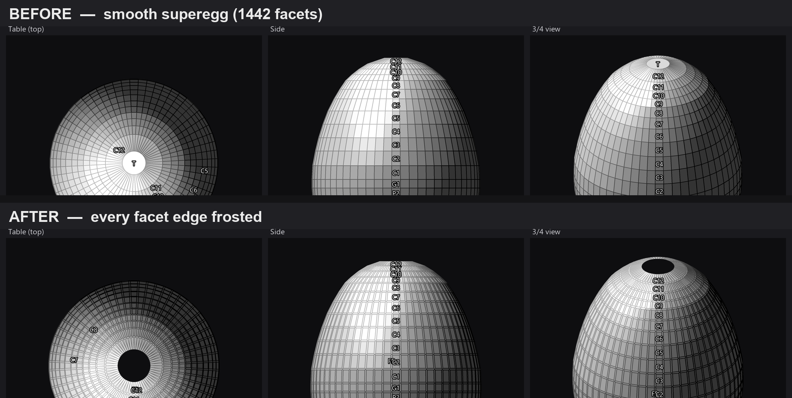

# FacetFroster

[](https://github.com/loydb/FacetFroster/releases/latest)

Add **edge frosting** to [Gem Cut Studio](https://gemcutstudio.com/) `.gcs`
faceting designs from the command line — including dense, high–facet-count
models (curved supereggs, spheres, freeform solids) that the interactive tool
can't load.

### Download & run

- **Windows —** **[⬇ FacetFroster for Windows](https://github.com/loydb/FacetFroster/releases/latest/download/FacetFroster-windows-exe.zip)**
  (self-contained, **no Java to install**). Extract the zip, then run
  `FacetFroster\FacetFroster.exe your-design.gcs` from a command prompt.
- **macOS / Linux —** **[⬇ FacetFroster.jar](https://github.com/loydb/FacetFroster/releases/latest/download/FacetFroster.jar)**
  (needs a [Java 25+](https://adoptium.net/) runtime). Run
  `java -jar FacetFroster.jar your-design.gcs`. The same jar also works on Windows.

That's it — the downloads are ready to use. You only need the
[build-from-source](#building-from-source) section if you want to modify or
rebuild FacetFroster yourself.



*A 1442-facet "superegg quartz" before and after — every facet edge frosted, the
frosted bands written as proper Gem Cut Studio tiers.*

## Is this useful to you?

I'm not sure how many people this will help. Sean's Java froster — the tool this
is built on — is far more full-featured: it lets you choose which tiers to
frost, and more. Its one catch is that it fails with a manifold collapse when a
design packs a lot of facets at very close angles.

This project grew out of a request on the faceting Discord to frost a 2000+
facet superegg. Unlike Sean's tool, FacetFroster just adds edge frosting to
*every* facet in whatever design you feed it — the final SuperEgg came out at
almost 4,500 facets. You can always edit the resulting `.gcs` by hand afterward.

Hopefully someone else gets some use out of it.

## About Gem Cut Studio

[**Gem Cut Studio**](https://gemcutstudio.com/), by **Rej Poirier**, is design
software for faceted gemstones — *"gem design, in real-time"*, in its own words.
You work in the terms a faceter actually cuts to — tiers, angles, index gear —
and see the finished stone rendered as you go, so a design can be judged on
screen before anything is ground against a lap. Its designs are the `.gcs` files
FacetFroster reads and writes.

**Frosting** is a finish where a facet is left matte/textured instead of
polished, so it scatters light rather than reflecting it. Gem Cut Studio can
frost whole facets; *edge* frosting — a thin frosted band along every facet
boundary, leaving polished centres — is what Sean O'Neil's tool (below) adds,
and what FacetFroster drives at scale.

FacetFroster is an independent tool. It is not affiliated with Gem Cut Studio;
it reads and writes that program's `.gcs` format.

## Credit — Sean O'Neil's Edge Frosting Tool

**FacetFroster is a wrapper. All of the actual edge-frosting geometry is the
work of Sean O'Neil, author of the _Edge Frosting Tool_.** The frosting
algorithm, the gem/facet/plane geometry kernel, and every bevel this program
produces come from his tool — FacetFroster only adds command-line
orchestration, I/O, and packaging around it. It calls into his classes for 100%
of the geometry (`lap.model.Gem.cutFrostedEdges` / `getEdgeParameters` / `cut` /
`getEdgesFromFacets`, `Facet`, `Edge`, `Cut`, `Tier`, `lap.math.Plane`,
`Point3D`, `ProgressValue`).

Please credit **Sean O'Neil's Edge Frosting Tool** in any use of FacetFroster.
His official release (a runnable jar that also includes his scaled-PDF feature):
<https://www.mediafire.com/file/ood63rjcv8ixorv/edge-frosting-tool-plus-scaled-pdf-v7.jar/file>

## Why this exists

Gem Cut Studio and Sean's tool both reconstruct a gem by **replaying each tier
as a cut** from a starting blank when they load a `.gcs`. That works for typical
hand-cut faceting designs, but it collapses on dense, curved models: a 60-fold
"superegg" with 1442 explicit facets reconstructs to ~38 facets and then
crashes.

FacetFroster bypasses the lossy importer: it parses the `.gcs` facets
**verbatim** into Sean's `Gem` model, lets his `getEdgesFromFacets()` build a
clean 2-facets-per-edge manifold, then runs his frosting algorithm on that. It
also:

- **auto-tunes** the vertex-weld tolerance to the smallest value that yields a
  closed manifold,
- shows a **live console progress bar** (polls Sean's `ProgressValue`),
- writes a **corrected exporter** — frosted bevels go into proper per-angle/depth
  tiers (each an independent Gem Cut Studio cut with a sane gear index list)
  rather than lumped into one tier that Gem Cut Studio mis-reads,
- supports **checkpointing** (`FacetFrosterCkpt`) for very long runs — a rolling
  window of `.gcs` snapshots every N%,
- routes the tool's modal warning dialogs to the console so it never blocks a
  headless run (`Messages` shadow).

## Building from source

**Most people don't need this** — the [downloads above](#download--run) are ready
to run on Windows, macOS, and Linux. Build from source only if you want to modify
FacetFroster or rebuild the Windows exe yourself.

You'll need a JDK (developed against JDK 25 — `javac`, `jar`, and, for the exe,
`jpackage`) and Sean O'Neil's Edge Frosting Tool jar (download link
[above](#credit--sean-oneils-edge-frosting-tool)). Point the build at his jar
(an already-extracted folder works too):

```powershell
# from the repo root — builds out\FacetFroster.jar (+ a self-contained exe zip):
powershell -File scripts\build_exe.ps1 -Tool <edge-frosting-tool-plus-scaled-pdf-v7.jar>
powershell -File scripts\build_exe.ps1 -Tool <...v7.jar> -NoExe   # jar only, no exe
```

Or compile by hand (compile the `Messages` shadow first so the frosters link
against the console version, not the tool's dialog version — `<tool>` is Sean's
jar or its extracted folder):

```
javac -cp "<tool>" -d build src\Messages.java
javac -cp "build;<tool>" -d build src\FacetFroster.java src\FacetFrosterCkpt.java
```

## Usage

```
FacetFroster.exe <input.gcs> [width | N%] [-o out.gcs]      # or: java -jar FacetFroster.jar ...
```

- Output defaults to `<input dir>\<name>_frosted.gcs`.
- `width`: a bare number = model units; `N%` = percent of model width (default 1%).
- Thin-girdle designs: a 1% bevel can overlap into spiky geometry — use a
  smaller width (e.g. `0.3%`).

Checkpointed (large/dense designs, many minutes) — a rolling window of 3 `.gcs`
snapshots every `pct`%, so a crash/power-loss doesn't lose the whole run:

```
java -cp out\FacetFroster.jar FacetFrosterCkpt <in.gcs> <out.gcs> <width|N%> <ckptDir> [pct]
```

`scripts\facetfroster_checkpointed.ps1` wraps that with auto-restart on a true hang.

## Licensing

- **FacetFroster's own code** (`src/`, `scripts/`) — see [LICENSE](LICENSE) (MIT).
- **Sean O'Neil's Edge Frosting Tool** — his own work, under his own terms; not
  included in this source repo. The release binaries embed it with his permission.
- **Gem Cut Studio** — Rej Poirier's software; FacetFroster only reads/writes its
  `.gcs` file format and is not affiliated with it.

## Files

| File | What it is |
|------|-----------|
| `src/FacetFroster.java` | one-shot froster: verbatim load + auto-tune + progress bar + corrected exporter |
| `src/FacetFrosterCkpt.java` | checkpointing froster (rolling-N `.gcs` snapshots) for long runs |
| `src/Messages.java` | console shadow of the tool's `lap.menu.Messages` (no blocking dialogs) |
| `scripts/build_exe.ps1` | build + verify `FacetFroster.jar` and a self-contained exe zip (`-Tool <Sean's jar>`) |
| `scripts/facetfroster_checkpointed.ps1` | parameterized recovery runner (rolling checkpoints + auto-restart on hang) |
