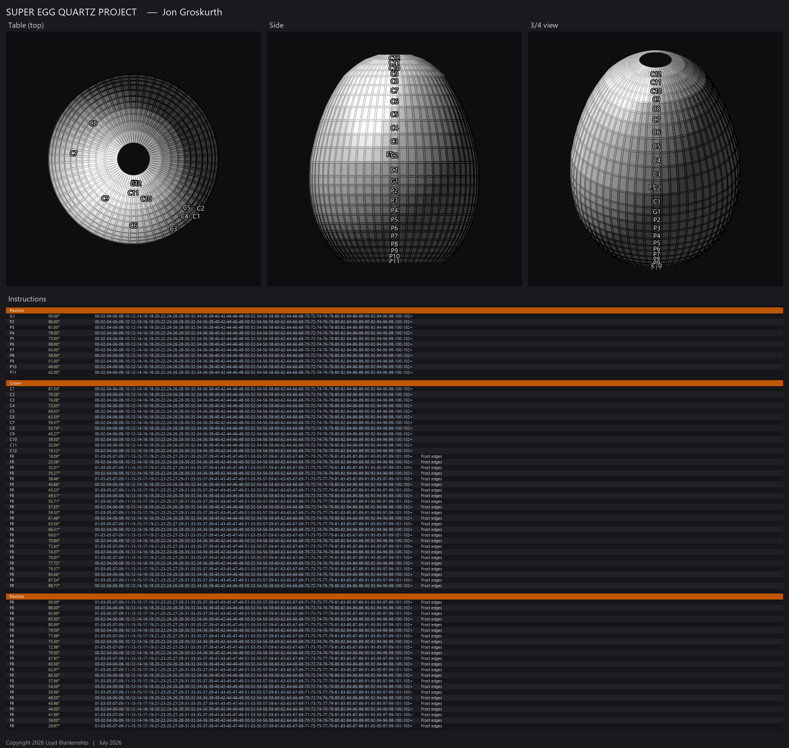

# GCS Edge Frosting CLI

A headless, scriptable command-line wrapper for adding **edge frosting** to
GemCutStudio `.gcs` faceting designs — including dense, high–facet-count models
(curved supereggs, spheres, freeform solids) that the interactive tool cannot
load. It adds a live progress bar, batch/automation support, checkpointing for
long runs, and a corrected `.gcs` exporter, and it runs with no GUI.



---

## Credit — Sean O'Neil's Edge Frosting Tool

**This project is a wrapper. All of the actual edge-frosting geometry is the
work of Sean O'Neil, author of the _Edge Frosting Tool_.** The frosting
algorithm, the gem/facet/plane geometry kernel, and every bevel this program
produces come from his tool — this repository only adds command-line
orchestration, I/O, and packaging around it.

Specifically, this wrapper calls into Sean O'Neil's classes for 100% of the
geometry:

- `lap.model.Gem.cutFrostedEdges(...)` — the frosting algorithm itself
- `lap.model.Gem.getEdgeParameters(...)` — per-edge bevel parameters
- `lap.model.Gem.cut(...)` — the geometry cut that carves each bevel
- `lap.model.Gem.getEdgesFromFacets()`, `Facet`, `Edge`, `Cut`, `Tier`,
  `lap.math.Plane`, `lap.math.Point3D`, `lap.math.ProgressValue`

Please credit **Sean O'Neil's Edge Frosting Tool** in any use of this project.

> _Project / contact link: **TODO — add the URL for Sean's Edge Frosting Tool
> here.**_

> **The Edge Frosting Tool itself is NOT redistributed in this repository.**
> You must obtain Sean's tool separately and build against it (see
> [Building](#building)). See [Licensing](#licensing) below.

---

## Why this exists

Sean's Edge Frosting Tool is a Swing desktop application whose `.gcs` importer
reconstructs a gem by **replaying each tier as a cut** from a starting blank.
That works for typical hand-cut faceting designs, but it collapses on dense,
curved models: a 60-fold "superegg" with 1442 explicit facets reconstructs to
~38 facets and then crashes.

This wrapper bypasses the lossy importer: it parses the `.gcs` facets
**verbatim** into Sean's `Gem` model, lets his `getEdgesFromFacets()` build a
clean 2-facets-per-edge manifold, then runs his frosting algorithm on that. It
also:

- **auto-tunes** the vertex-weld tolerance to the smallest value that yields a
  closed manifold,
- shows a **live console progress bar** (polls Sean's `ProgressValue`),
- writes a **corrected exporter** — frosted bevels are distributed into proper
  per-angle/depth tiers (each an independent GemCutStudio cut with a sane gear
  index list) rather than lumped into a single tier that GemCutStudio
  mis-reads,
- supports **checkpointing** (`FrostCkpt`) for very long runs — a rolling
  window of `.gcs` snapshots every N%,
- routes the tool's modal warning dialogs to the console so it never blocks a
  headless run (`Messages` shadow).

## Building

Requires a JDK (developed against JDK 25) and Sean O'Neil's Edge Frosting Tool
(the compiled `lap/` classes / jar).

```
# point the classpath at Sean's tool, then:
javac -cp "<edge-frosting-tool>" src/Messages.java src/FrostCLI.java -d build
# (compile Messages first so FrostCLI links against the console shadow)
```

`scripts/build_exe.ps1` builds a self-contained Windows exe (bundles a JRE via
`jpackage`) and a runnable jar. Because that packaging embeds Sean's classes,
**only distribute the result if his license permits it** (see below).

## Usage

```
frost <input.gcs> [width | N%] [-o out.gcs]
```

- Output defaults to `<input dir>\<name>_frosted.gcs`.
- `width`: a bare number = model units; `N%` = percent of model width (default 1%).
- Thin-girdle designs: a 1% bevel can overlap into spiky geometry — use a
  smaller width (e.g. `0.3%`).

Checkpointed (long runs):

```
java -cp "<scratch>;<build-with-Messages-shadow>" FrostCkpt <in.gcs> <out.gcs> <width|N%> <ckptDir> [pct]
```

## Licensing

- **This wrapper code** (`src/`, `scripts/`) — see [LICENSE](LICENSE).
- **Sean O'Neil's Edge Frosting Tool** — his own work, under his own terms, and
  **not included here**. Obtain it from Sean and comply with his license.
  Redistributing a built jar/exe that embeds his classes requires his
  permission.

## Files

| File | What it is |
|------|-----------|
| `src/FrostCLI.java` | one-shot froster: verbatim load + auto-tune + progress bar + corrected exporter |
| `src/FrostCkpt.java` | checkpointing froster (rolling-N `.gcs` snapshots) for long runs |
| `src/Messages.java` | console shadow of the tool's `lap.menu.Messages` (no blocking dialogs) |
| `scripts/build_exe.ps1` | build + verify a self-contained exe (zips it; Dropbox-safe) |
| `scripts/run_superegg.ps1` | watchdog runner example |
| `scripts/format_frosted.py` | alternate two-step formatter |
